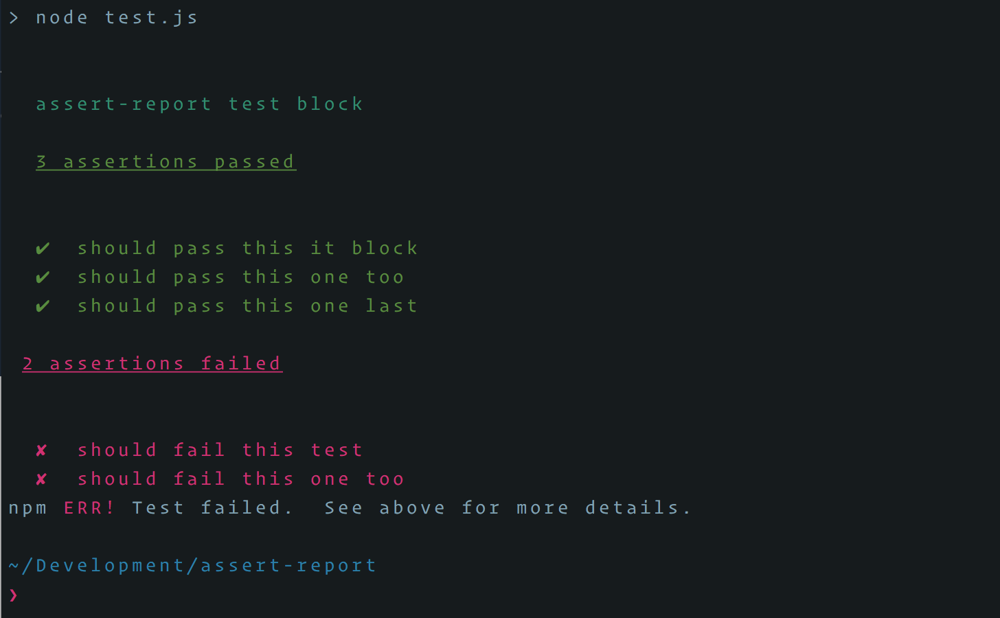

# assert-report

> A barebones test reporter in ~1.5kb with zero dependencies



## Overview

Do you have a really simple package that you want to test, but don't really need any bells or whistles? If so, this package might be helpful. assert-report provides an extremely minimal test result interface for those cases where you just want to write out a few tests in `test.js` and run `node test.js`. It's essentially a small wrapper around the native `assert` module.

If you want a test runner or super specific error messages, then this probably isn't what you're looking for.

## Install

```
$ npm install --save-dev assert-report
```

## Usage

assert-report exports two familar methods, `describe` and `it`

#### `describe(testSuite: string, assertions: () => void)`

```js
describe('your test suite', () => {
  // it blocks go here
})
```

#### `it(testSuite: string, assertion: (assert) => void)`

```js
describe('your test suite', () => {
  it('should use assert to pass or fail a test', assert => {
    assert(myObject.property === expectedProperty)
  })
})
```
